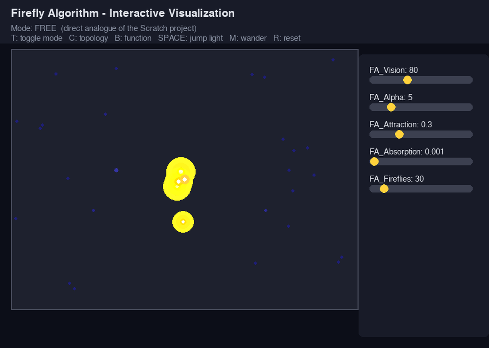
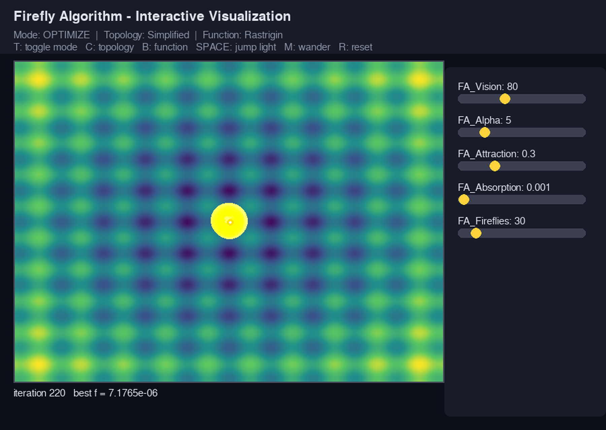
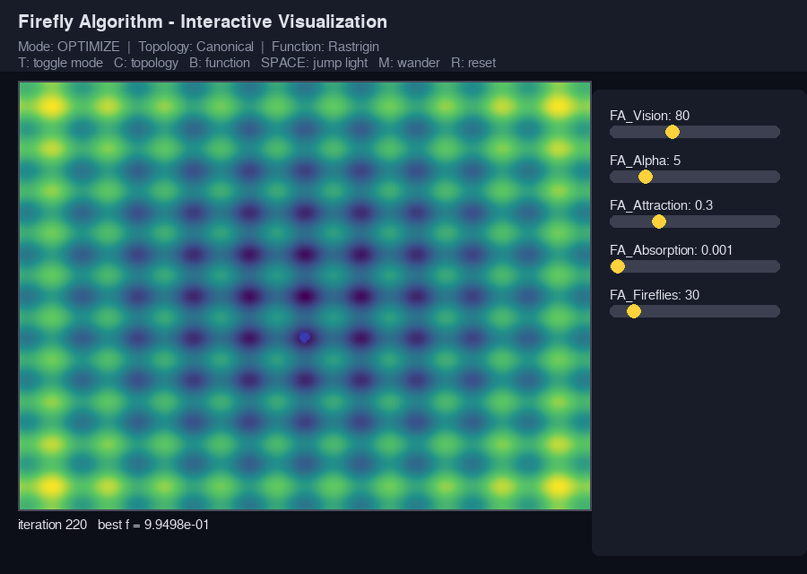

# Firefly Algorithm -- Bio-Inspired AI in K-12 and Postgraduate STEM Education

A two-tier implementation of Yang's Firefly Algorithm (FA), a nature-inspired swarm-intelligence metaheuristic, designed to make its core mechanism -- attraction that decays with distance -- directly manipulable across grade bands, from elementary school to postgraduate study.

This is the companion code to a peer-reviewed article on introducing bio-inspired AI algorithms in K-12 and postgraduate STEM education using block-based and textual programming environments. Three implementations are provided, all sharing the same underlying mathematics and variable names so that a student moving between them can recognize the same algorithm in each form.

## What's inside

```
firefly-algorithm/
  scratch/
    FireflyAlgorithm_FA.sb3       MIT Scratch project (K-12 / block-based)
  python/
    firefly_pedagogical.py       Analytical module: benchmarking & convergence verification
    firefly_pygame.py            Interactive real-time visualization (Pygame)
    requirements.txt
  docs/
    screenshots/                 Preview images (see below)
```

### 1. `scratch/FireflyAlgorithm_FA.sb3` -- MIT Scratch (K-12)

A single-attractor simplification of FA: a swarm of firefly sprites is attracted to one shared light source, with attraction strength coupled to distance via a Gaussian absorption term (`beta(r) = beta_0 * e^(-gamma * r^2)`), implemented block-for-block using Scratch's built-in exponential operator.

**Controls (on stage, once run):**
- **Sliders** (top-left): `FA_Vision`, `FA_Alpha`, `FA_Attraction`, `FA_Absorption`, `FA_Fireflies` -- adjustable live, while the simulation runs
- **Click** the light, or **drag** it, to reposition it by hand
- **SPACE** -- jump the light to a random position
- **M** -- toggle continuous autonomous wandering of the light

**To run it:** go to [scratch.mit.edu](https://scratch.mit.edu), create a new project, then **File -> Load from your computer** and select `FireflyAlgorithm_FA.sb3`. (Alternatively, open it in the free [Scratch offline desktop editor](https://scratch.mit.edu/download).)

### 2. `python/firefly_pedagogical.py` -- Analytical module

Two classes sharing an interface but differing in topology:

- **`FireflyAlgorithmCanonical`** -- the full O(n^2) pairwise algorithm as published by Yang: every firefly compares itself against every other firefly.
- **`FireflyAlgorithmSimplified`** -- the O(n) single-attractor variant that mirrors the Scratch project exactly, for direct comparison.

Also includes three benchmark objective functions (Sphere, Rastrigin, Ackley) and a `__main__` block that runs both classes on Rastrigin, prints the best value found, and saves a convergence/swarm-position comparison plot.

```bash
pip install -r requirements.txt
python3 firefly_pedagogical.py
```

### 3. `python/firefly_pygame.py` -- Interactive visualization

A real-time, manipulable visualization with two modes (press **T** to toggle):

- **Free-Roam mode** -- the direct interactive analogue of the Scratch project: drag the light with the mouse, jump it with **SPACE**, or set it wandering with **M**. No fitness function is involved, matching the Scratch project's design exactly.
- **Optimize mode** -- renders an actual fitness landscape (Sphere or Rastrigin, toggle **B**) as a background heat map and runs genuine FA search on it, with topology toggled by **C** between `Simplified` (light tracks the best firefly found) and `Canonical` (full pairwise comparison -- watch for sub-grouping around multiple local minima).

Five on-screen sliders mirror the Scratch stage monitors exactly, adjustable live in either mode.

```bash
pip install -r requirements.txt
python3 firefly_pygame.py
```

**Full controls:**

| Key / mouse | Effect |
|---|---|
| Slider drag | Adjust `FA_Vision`, `FA_Alpha`, `FA_Attraction`, `FA_Absorption`, `FA_Fireflies` live |
| Drag the light (Free-Roam) | Reposition it by hand |
| `SPACE` (Free-Roam) | Jump the light to a random position |
| `M` (Free-Roam) | Toggle autonomous wandering |
| `T` | Toggle Free-Roam / Optimize mode |
| `C` (Optimize) | Toggle Simplified / Canonical topology |
| `B` (Optimize) | Toggle Sphere / Rastrigin fitness landscape |
| `R` | Reset / respawn the swarm |
| `Esc` / close window | Quit |

## Screenshots

| Free-Roam mode | Optimize -- Simplified | Optimize -- Canonical |
|---|---|---|
|  |  |  |

## The mathematics, briefly

Attractiveness decays with squared distance following a Gaussian absorption model:

```
beta(r) = beta_0 * exp(-gamma * r^2)
```

where `beta_0` is the base attraction strength (`FA_Attraction`) and `gamma` is the absorption coefficient (`FA_Absorption`). Each firefly's position update combines this attraction term with a decaying random-walk noise term:

```
x_i(t+1) = x_i(t) + beta(r)*(x_j(t) - x_i(t)) + alpha*(epsilon - 1/2)
```

All three implementations in this folder use exactly this rule -- only the topology (single shared attractor vs. full pairwise comparison) and the coordinate scale (pixel space vs. a bounded mathematical domain) differ between them.

## Requirements

See `python/requirements.txt`. In short: `numpy` and `matplotlib` for the analytical module; `numpy` and `pygame` for the interactive visualization.

## Citation

If you use this code, please cite the accompanying article (full citation to be added once published) and, if referencing the Scratch project specifically, the Scratch project itself as published on [scratch.mit.edu](https://scratch.mit.edu).

## License

MIT -- see [../LICENSE](../LICENSE).
